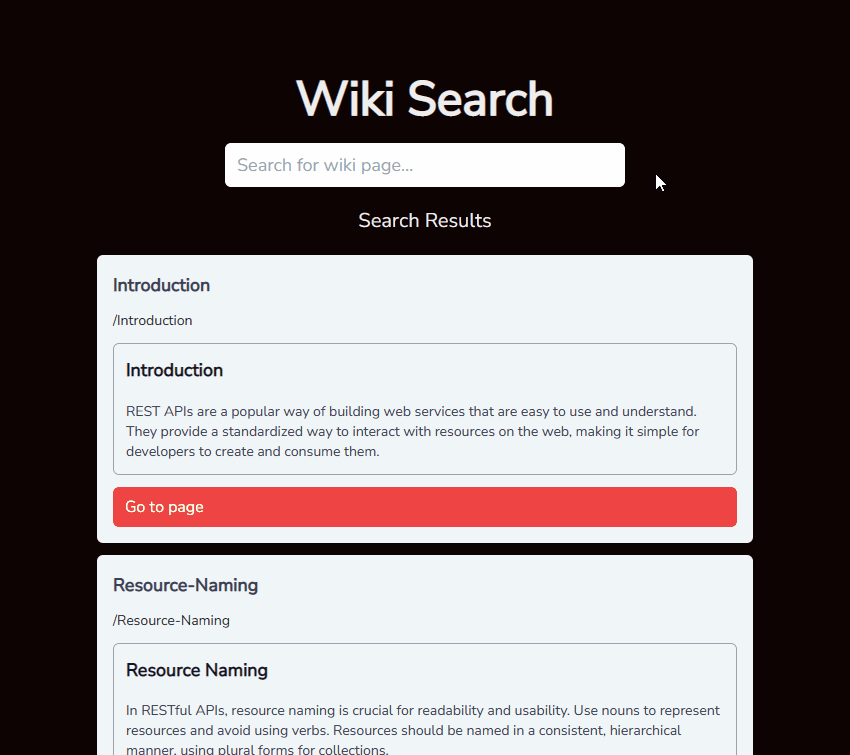

# Wiki Search

This project is a POC to show how search could be implemented for Wiki Pages that can be either fetched from an API or scraped.

## Dependencies

- Docker - To run the MeiliSearch DB. MeiliSearch can also be run without Docker.
- MeiliSearch - Search DB (can be started via the docker-compose.yml file)
- pnpm - An alternative to NPM

## Preview



# Getting Started

First, start MeiliSearch by running the docker compose file using the terminal command `docker-compose up` inside the root folder (where the `docker-compose.yml` file exists).

Then, run the development server:

```bash
pnpm run dev
```

Open [http://localhost:3000](http://localhost:3000) with your browser to see the search page.

Before search will work, you need to seed the database. You can do this by navigating to the following page:
`/api/seed-db`

Accessing this API endpoint will delete the existing data and seed new data into the DB.
